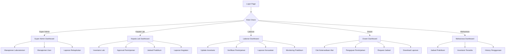

## 1. Product Overview
Sistem Manajemen Laboratorium untuk Fakultas Teknik Universitas Mulawarman adalah platform digital untuk mengelola seluruh aspek operasional laboratorium secara terpusat dan efisien. Sistem ini memungkinkan pengelolaan inventaris, peminjaman alat, jadwal praktikum, serta pelaporan kerusakan dengan workflow approval yang terstruktur.

Sistem ini dirancang untuk mengatasi permasalahan manual dan tidak terintegrasi dalam pengelolaan laboratorium, memberikan transparansi informasi ketersediaan alat, serta meningkatkan efisiensi proses peminjaman dan pemeliharaan peralatan laboratorium.

## 2. Core Features

### 2.1 User Roles
| Role | Registration Method | Core Permissions |
|------|---------------------|------------------|
| Super Admin | Admin panel registration | Full system access, manage all laboratories, user management, system configuration |
| Kepala Lab | Admin assignment | Manage lab inventory, approve borrowing requests, manage practicum schedules, generate lab reports |
| Laboran/Asisten | Admin assignment | Update inventory, verify borrowing requests, record equipment damage, monitor practicum activities |
| Dosen | Self-registration with approval | Submit borrowing requests, request practicum schedules, view equipment availability, download reports |
| Mahasiswa | Self-registration with NIM validation | View practicum schedules, browse available inventory, view lab usage history |

### 2.2 Feature Module
Sistem ini terdiri dari halaman-halaman utama berikut:

1. **Dashboard**: Statistik dan ringkasan aktivitas sistem
2. **Manajemen Laboratorium**: Data master laboratorium dan pengelolaannya
3. **Inventaris**: Pengelolaan alat dan bahan laboratorium
4. **Peminjaman**: Pengajuan dan approval peminjaman alat
5. **Jadwal Praktikum**: Kalender dan booking jadwal praktikum
6. **Laporan Kerusakan**: Pelaporan dan tracking perbaikan alat
7. **Laporan & Statistik**: Dashboard analitik dan export laporan
8. **Manajemen User**: Pengelolaan pengguna dan hak akses
9. **Profil**: Pengaturan akun pengguna

### 2.3 Page Details
| Page Name | Module Name | Feature description |
|-----------|-------------|---------------------|
| Dashboard | Statistik Utama | Menampilkan grafik jumlah alat per kategori, alat yang sering dipinjam, tingkat utilisasi lab, trend peminjaman per bulan |
| Dashboard | Quick Actions | Shortcut ke fungsi-fungsi utama berdasarkan role pengguna |
| Manajemen Laboratorium | Lab List | Menampilkan daftar laboratorium dengan filter dan pencarian, informasi lokasi, kapasitas, status operasional |
| Manajemen Laboratorium | Lab Details | Form input/edit data laboratorium lengkap dengan upload foto dan denah |
| Manajemen Laboratorium | Lab Personnel | Mengelola Kepala Lab dan Laboran yang ditugaskan di setiap laboratorium |
| Inventaris | Item List | Menampilkan daftar alat dan bahan dengan filter kategori, status, ketersediaan, pencarian barcode/QR code |
| Inventaris | Item Management | CRUD inventaris lengkap dengan upload foto, generate barcode/QR code, set stok minimum |
| Inventaris | Maintenance History | Mencatat dan menampilkan history pemeliharaan dan kalibrasi alat |
| Peminjaman | Borrowing Form | Form pengajuan peminjaman dengan cek ketersediaan real-time, pemilihan alat dan jadwal |
| Peminjaman | Approval Workflow | Tampilan approval untuk Laboran dan Kepala Lab dengan notifikasi status |
| Peminjaman | Borrowing History | Tracking status peminjaman, generate surat peminjaman PDF, pencatatan pengembalian |
| Jadwal Praktikum | Schedule Calendar | Kalender interaktif menampilkan jadwal praktikum semua lab dengan warna berbeda per lab |
| Jadwal Praktikum | Booking Form | Form booking ruang lab dengan cek bentrok jadwal, input detail mata kuliah dan peserta |
| Jadwal Praktikum | Schedule Management | Edit/hapus jadwal, reminder otomatis H-1 via email |
| Laporan Kerusakan | Damage Report Form | Form pelaporan kerusakan dengan upload foto kondisi alat |
| Laporan Kerusakan | Repair Tracking | Update status perbaikan, input biaya perbaikan, history perbaikan |
| Laporan & Statistik | Analytics Dashboard | Grafik interaktif dengan filter periode, lab, kategori untuk analisis utilisasi |
| Laporan & Statistik | Report Export | Export data ke PDF/Excel dengan template yang dapat disesuaikan |
| Manajemen User | User List | Daftar pengguna dengan filter role, program studi, status aktif |
| Manajemen User | User Form | CRUD user dengan validasi NIP/NIM uniq, reset password, assign role |
| Manajemen User | Activity Log | Log aktivitas user untuk audit trail |
| Profil | User Profile | Edit informasi pribadi, upload foto, ganti password |
| Login | Authentication | Login dengan email/NIP/NIM, forgot password, remember me |

## 3. Core Process

### Super Admin Flow
1. Login ke sistem menggunakan kredensial admin
2. Mengakses dashboard untuk melihat overview sistem
3. Membuat master data laboratorium beserta personelnya
4. Mengelola user dan menetapkan role sesuai jabatan
5. Memantau seluruh aktivitas peminjaman dan jadwal praktikum
6. Generate laporan rekapitulasi untuk kebutuhan fakultas

### Kepala Lab Flow
1. Login dan mengakses dashboard khusus Kepala Lab
2. Mengelola inventaris laboratorium yang dipimpinnya
3. Menerima notifikasi pengajuan peminjaman untuk di-approve
4. Mengelola jadwal praktikum laboratoriumnya
5. Memonitor pelaporan kerusakan alat
6. Generate laporan kegiatan laboratorium bulanan

### Laboran Flow
1. Login sebagai Laboran
2. Update status ketersediaan alat secara berkala
3. Verifikasi peminjaman yang masuk
4. Mencatat kerusakan alat yang dilaporkan
5. Update status perbaikan alat
6. Memantau pelaksanaan praktikum di lab

### Dosen Flow
1. Register akun dengan NIP dan menunggu approval
2. Login dan melihat dashboard dosen
3. Mencari dan mengecek ketersediaan alat yang dibutuhkan
4. Mengajukan peminjaman alat dengan jadwal yang diinginkan
5. Menerima notifikasi approval/rejection
6. Download surat peminjaman yang telah disetujui
7. Request jadwal praktikum untuk mata kuliahnya

### Mahasiswa Flow
1. Register dengan NIM untuk verifikasi
2. Login dan melihat dashboard mahasiswa
3. Melihat jadwal praktikum untuk lab yang akan digunakan
4. Browse inventaris alat yang tersedia
5. Melihat history penggunaan lab (jika diaktifkan)

## 4. User Interface Design

### 4.1 Design Style
- **Primary Color**: Biru gelap (#1e40af) untuk header dan elemen utama
- **Secondary Color**: Abu-abu terang (#f3f4f6) untuk background dan card
- **Accent Color**: Hijau (#10b981) untuk status aktif dan success
- **Warning Color**: Kuning (#f59e0b) untuk peringatan dan pending status
- **Error Color**: Merah (#ef4444) untuk error dan rejected status

- **Button Style**: Rounded dengan shadow subtle, hover effect ring-2
- **Font Family**: Inter untuk heading, Roboto untuk body text
- **Font Sizes**: 
  - Heading 1: 2rem (32px)
  - Heading 2: 1.5rem (24px)
  - Body: 1rem (16px)
  - Small: 0.875rem (14px)

- **Layout Style**: Sidebar navigation + top header, card-based content
- **Icons**: Heroicons untuk consistency, emoji minimal untuk status indicator

### 4.2 Page Design Overview
| Page Name | Module Name | UI Elements |
|-----------|-------------|-------------|
| Dashboard | Statistik Card | Card dengan icon besar, angka prominent, trend indicator dengan arrow up/down |
| Dashboard | Chart Container | Chart.js integration dengan legend interaktif, filter dropdown periode |
| Inventaris | Item Card | Card horizontal dengan foto alat, status badge, action button group |
| Inventaris | Filter Panel | Collapsible sidebar filter dengan checkbox categories, status chips |
| Peminjaman | Timeline Approval | Vertical timeline menampilkan status approval dengan timestamp dan user |
| Jadwal Praktikum | Calendar View | FullCalendar.js dengan view month/week/day, color-coded per lab |
| Laporan Kerusakan | Damage Form | Form multi-step dengan progress indicator, drag-drop upload foto |
| User Management | Data Table | Table dengan sorting, pagination, inline action buttons, search box |

### 4.3 Responsiveness
- **Desktop-first approach** dengan breakpoint:
  - Mobile: < 640px
  - Tablet: 640px - 1024px
  - Desktop: > 1024px
- **Touch optimization** untuk tablet dengan button size minimum 44px
- **Collapsible sidebar** di mobile yang berubah menjadi bottom navigation
- **Responsive tables** dengan horizontal scroll dan column priority
- **Modal and drawer** untuk form di mobile untuk efisiensi space

### 4.4 Additional UI Features
- **Dark Mode**: Toggle di header dengan localStorage persistence
- **Loading States**: Skeleton screens untuk initial load, spinner untuk actions
- **Empty States**: Ilustrasi dan call-to-action untuk data kosong
- **Notifications**: Toast notifications untuk success/error actions
- **Breadcrumbs**: Untuk navigasi deep pages
- **Help Tooltips**: Question mark icon dengan tooltip untuk field yang membutuhkan penjelasan