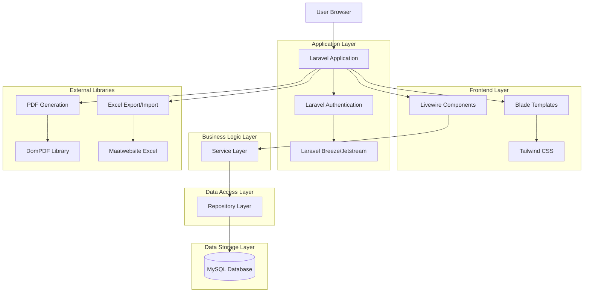
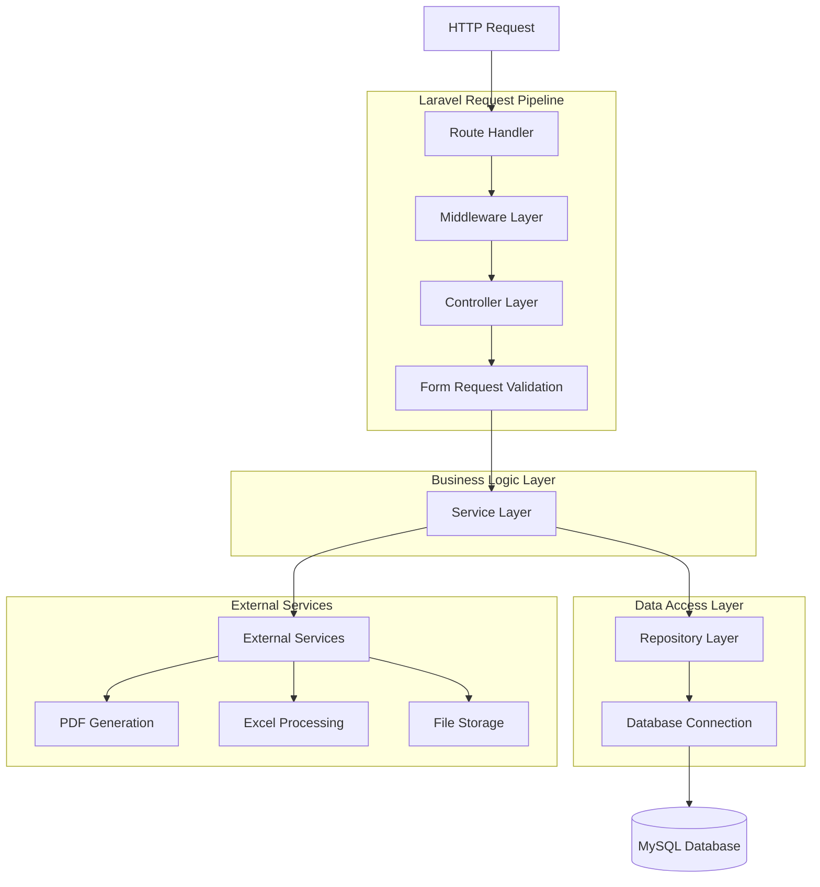
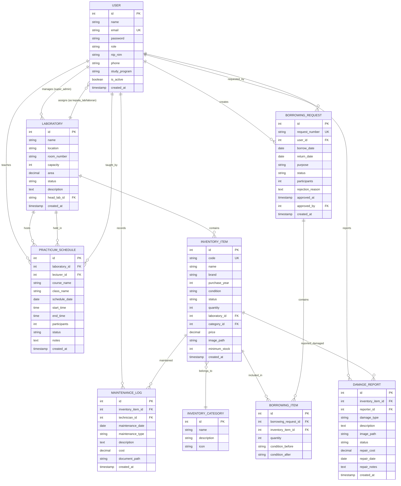

## 1. Architecture design



## 2. Technology Description

- **Backend Framework**: Laravel 12.x dengan PHP 8.2+
- **Frontend**: Blade templating engine + Livewire 3.x untuk interaktivitas
- **CSS Framework**: Tailwind CSS 3.x
- **Database**: MySQL 8.0 / PostgreSQL 14+
- **Authentication**: Laravel Breeze/Jetstream
- **Admin Panel**: Filament 3.x (alternatif untuk dashboard cepat)
- **PDF Generation**: DomPDF untuk surat peminjaman dan laporan
- **Excel Processing**: Maatwebsite Excel untuk import/export data
- **Validation**: Laravel Form Request Validation
- **Testing**: PHPUnit, Laravel Dusk untuk browser testing

## 3. Route definitions

| Route | Purpose | Middleware |
|-------|---------|------------|
| / | Landing page atau redirect ke dashboard | web |
| /login | Halaman login user | guest |
| /register | Halaman registrasi (untuk dosen/mahasiswa) | guest |
| /dashboard | Dashboard utama berdasarkan role | auth |
| /admin/* | Semua route admin (Super Admin) | auth, role:super_admin |
| /laboratories | Manajemen laboratorium | auth, role:super_admin |
| /inventory | Inventaris alat dan bahan | auth, role:super_admin,laboran,kepala_lab |
| /borrowing | Pengajuan dan approval peminjaman | auth |
| /schedule | Jadwal praktikum | auth |
| /damage-report | Laporan kerusakan alat | auth |
| /reports | Laporan dan statistik | auth, role:super_admin,kepala_lab |
| /users | Manajemen user | auth, role:super_admin |
| /profile | Profil user | auth |

## 4. API definitions

### 4.1 Authentication API

```
POST /login
```

Request:
| Param Name | Param Type | isRequired | Description |
|------------|------------|-------------|-------------|
| email | string | true | Email atau NIP/NIM user |
| password | string | true | Password user |

Response:
```json
{
  "user": {
    "id": 1,
    "name": "John Doe",
    "email": "john@example.com",
    "role": "dosen",
    "avatar": "path/to/avatar.jpg"
  },
  "token": "sanctum_token_here"
}
```

### 4.2 Inventory Management API

```
GET /api/inventory
```

Query Parameters:
| Param Name | Param Type | Description |
|------------|------------|-------------|
| category | string | Filter by category |
| status | string | Filter by status (tersedia/dipinjam/rusak) |
| laboratory_id | integer | Filter by laboratory |
| search | string | Search by name or code |

Response:
```json
{
  "data": [
    {
      "id": 1,
      "code": "LAB-001",
      "name": "Oscilloscope",
      "category": "Elektronika",
      "status": "tersedia",
      "laboratory": "Lab Elektronika",
      "image": "path/to/image.jpg"
    }
  ],
  "meta": {
    "total": 150,
    "per_page": 15,
    "current_page": 1
  }
}
```

### 4.3 Borrowing Management API

```
POST /api/borrowing
```

Request:
| Param Name | Param Type | isRequired | Description |
|------------|------------|-------------|-------------|
| items | array | true | Array of item IDs |
| borrow_date | date | true | Tanggal pinjam |
| return_date | date | true | Tanggal kembali |
| purpose | string | true | Keperluan peminjaman |
| participants | integer | false | Jumlah peserta (untuk praktikum) |

Response:
```json
{
  "message": "Peminjaman berhasil diajukan",
  "borrowing": {
    "id": 1,
    "request_number": "BR-2024-001",
    "status": "pending",
    "borrow_date": "2024-01-20",
    "return_date": "2024-01-27"
  }
}
```

## 5. Server architecture diagram



## 6. Data model

### 6.1 Data model definition



### 6.2 Data Definition Language

#### Users Table
```sql
CREATE TABLE users (
    id BIGINT UNSIGNED PRIMARY KEY AUTO_INCREMENT,
    name VARCHAR(255) NOT NULL,
    email VARCHAR(255) UNIQUE NOT NULL,
    email_verified_at TIMESTAMP NULL,
    password VARCHAR(255) NOT NULL,
    role ENUM('super_admin', 'kepala_lab', 'laboran', 'dosen', 'mahasiswa') NOT NULL,
    nip_nim VARCHAR(50) UNIQUE NULL,
    phone VARCHAR(20) NULL,
    study_program VARCHAR(100) NULL,
    avatar_path VARCHAR(255) NULL,
    is_active BOOLEAN DEFAULT true,
    laboratory_id BIGINT UNSIGNED NULL,
    remember_token VARCHAR(100) NULL,
    created_at TIMESTAMP DEFAULT CURRENT_TIMESTAMP,
    updated_at TIMESTAMP DEFAULT CURRENT_TIMESTAMP ON UPDATE CURRENT_TIMESTAMP,
    
    INDEX idx_role (role),
    INDEX idx_laboratory (laboratory_id),
    INDEX idx_active (is_active),
    FOREIGN KEY (laboratory_id) REFERENCES laboratories(id) ON DELETE SET NULL
);
```

#### Laboratories Table
```sql
CREATE TABLE laboratories (
    id BIGINT UNSIGNED PRIMARY KEY AUTO_INCREMENT,
    name VARCHAR(255) NOT NULL,
    location VARCHAR(255) NOT NULL,
    room_number VARCHAR(50) NULL,
    capacity INT NOT NULL DEFAULT 0,
    area DECIMAL(10,2) NULL,
    status ENUM('aktif', 'maintenance', 'tidak_aktif') DEFAULT 'aktif',
    description TEXT NULL,
    head_lab_id BIGINT UNSIGNED NULL,
    floor_plan_path VARCHAR(255) NULL,
    created_at TIMESTAMP DEFAULT CURRENT_TIMESTAMP,
    updated_at TIMESTAMP DEFAULT CURRENT_TIMESTAMP ON UPDATE CURRENT_TIMESTAMP,
    
    INDEX idx_status (status),
    INDEX idx_head_lab (head_lab_id),
    FOREIGN KEY (head_lab_id) REFERENCES users(id) ON DELETE SET NULL
);
```

#### Inventory Categories Table
```sql
CREATE TABLE inventory_categories (
    id BIGINT UNSIGNED PRIMARY KEY AUTO_INCREMENT,
    name VARCHAR(100) NOT NULL,
    description TEXT NULL,
    icon VARCHAR(50) NULL,
    color VARCHAR(7) DEFAULT '#3B82F6',
    created_at TIMESTAMP DEFAULT CURRENT_TIMESTAMP,
    updated_at TIMESTAMP DEFAULT CURRENT_TIMESTAMP ON UPDATE CURRENT_TIMESTAMP,
    
    INDEX idx_name (name)
);

-- Insert sample categories
INSERT INTO inventory_categories (name, description, icon, color) VALUES
('Elektronika', 'Alat-alat elektronik dan komponen', 'cpu-chip', '#EF4444'),
('Mekanik', 'Alat-alat mekanik dan peralatan bengkel', 'wrench-screwdriver', '#F59E0B'),
('Komputer', 'Perangkat keras komputer dan jaringan', 'computer-desktop', '#10B981'),
('Peralatan Umum', 'Peralatan umum laboratorium', 'beaker', '#6366F1'),
('Bahan Habis Pakai', 'Bahan kimia dan consumables', 'test-tube', '#8B5CF6');
```

#### Inventory Items Table
```sql
CREATE TABLE inventory_items (
    id BIGINT UNSIGNED PRIMARY KEY AUTO_INCREMENT,
    code VARCHAR(100) UNIQUE NOT NULL,
    name VARCHAR(255) NOT NULL,
    brand VARCHAR(100) NULL,
    model VARCHAR(100) NULL,
    description TEXT NULL,
    purchase_year YEAR NULL,
    condition ENUM('baik', 'rusak_ringan', 'rusak_berat') DEFAULT 'baik',
    status ENUM('tersedia', 'dipinjam', 'rusak', 'maintenance', 'tidak_tersedia') DEFAULT 'tersedia',
    quantity INT NOT NULL DEFAULT 1,
    available_quantity INT NOT NULL DEFAULT 1,
    laboratory_id BIGINT UNSIGNED NOT NULL,
    category_id BIGINT UNSIGNED NOT NULL,
    price DECIMAL(15,2) NULL,
    image_path VARCHAR(255) NULL,
    barcode_path VARCHAR(255) NULL,
    minimum_stock INT DEFAULT 0,
    specifications JSON NULL,
    created_at TIMESTAMP DEFAULT CURRENT_TIMESTAMP,
    updated_at TIMESTAMP DEFAULT CURRENT_TIMESTAMP ON UPDATE CURRENT_TIMESTAMP,
    deleted_at TIMESTAMP NULL,
    
    INDEX idx_code (code),
    INDEX idx_status (status),
    INDEX idx_laboratory (laboratory_id),
    INDEX idx_category (category_id),
    INDEX idx_condition (condition),
    FOREIGN KEY (laboratory_id) REFERENCES laboratories(id) ON DELETE CASCADE,
    FOREIGN KEY (category_id) REFERENCES inventory_categories(id) ON DELETE RESTRICT
);
```

#### Borrowing Requests Table
```sql
CREATE TABLE borrowing_requests (
    id BIGINT UNSIGNED PRIMARY KEY AUTO_INCREMENT,
    request_number VARCHAR(50) UNIQUE NOT NULL,
    user_id BIGINT UNSIGNED NOT NULL,
    borrow_date DATE NOT NULL,
    return_date DATE NOT NULL,
    purpose TEXT NOT NULL,
    participants INT DEFAULT 0,
    status ENUM('pending', 'approved_by_laboran', 'approved', 'rejected', 'cancelled', 'completed') DEFAULT 'pending',
    rejection_reason TEXT NULL,
    approved_at TIMESTAMP NULL,
    approved_by BIGINT UNSIGNED NULL,
    completed_at TIMESTAMP NULL,
    notes TEXT NULL,
    created_at TIMESTAMP DEFAULT CURRENT_TIMESTAMP,
    updated_at TIMESTAMP DEFAULT CURRENT_TIMESTAMP ON UPDATE CURRENT_TIMESTAMP,
    
    INDEX idx_request_number (request_number),
    INDEX idx_user (user_id),
    INDEX idx_status (status),
    INDEX idx_borrow_date (borrow_date),
    INDEX idx_approved_by (approved_by),
    FOREIGN KEY (user_id) REFERENCES users(id) ON DELETE CASCADE,
    FOREIGN KEY (approved_by) REFERENCES users(id) ON DELETE SET NULL
);
```

#### Borrowing Items Table (Pivot)
```sql
CREATE TABLE borrowing_items (
    id BIGINT UNSIGNED PRIMARY KEY AUTO_INCREMENT,
    borrowing_request_id BIGINT UNSIGNED NOT NULL,
    inventory_item_id BIGINT UNSIGNED NOT NULL,
    quantity INT NOT NULL DEFAULT 1,
    condition_before TEXT NULL,
    condition_after TEXT NULL,
    returned_at TIMESTAMP NULL,
    notes TEXT NULL,
    created_at TIMESTAMP DEFAULT CURRENT_TIMESTAMP,
    updated_at TIMESTAMP DEFAULT CURRENT_TIMESTAMP ON UPDATE CURRENT_TIMESTAMP,
    
    INDEX idx_borrowing_request (borrowing_request_id),
    INDEX idx_inventory_item (inventory_item_id),
    UNIQUE KEY unique_borrowing_item (borrowing_request_id, inventory_item_id),
    FOREIGN KEY (borrowing_request_id) REFERENCES borrowing_requests(id) ON DELETE CASCADE,
    FOREIGN KEY (inventory_item_id) REFERENCES inventory_items(id) ON DELETE RESTRICT
);
```

#### Practicum Schedules Table
```sql
CREATE TABLE practicum_schedules (
    id BIGINT UNSIGNED PRIMARY KEY AUTO_INCREMENT,
    laboratory_id BIGINT UNSIGNED NOT NULL,
    lecturer_id BIGINT UNSIGNED NOT NULL,
    course_name VARCHAR(255) NOT NULL,
    class_name VARCHAR(100) NOT NULL,
    schedule_date DATE NOT NULL,
    start_time TIME NOT NULL,
    end_time TIME NOT NULL,
    participants INT NOT NULL DEFAULT 0,
    status ENUM('scheduled', 'ongoing', 'completed', 'cancelled') DEFAULT 'scheduled',
    notes TEXT NULL,
    created_by BIGINT UNSIGNED NOT NULL,
    created_at TIMESTAMP DEFAULT CURRENT_TIMESTAMP,
    updated_at TIMESTAMP DEFAULT CURRENT_TIMESTAMP ON UPDATE CURRENT_TIMESTAMP,
    
    INDEX idx_laboratory_date (laboratory_id, schedule_date),
    INDEX idx_lecturer (lecturer_id),
    INDEX idx_status (status),
    INDEX idx_time_range (start_time, end_time),
    FOREIGN KEY (laboratory_id) REFERENCES laboratories(id) ON DELETE CASCADE,
    FOREIGN KEY (lecturer_id) REFERENCES users(id) ON DELETE RESTRICT,
    FOREIGN KEY (created_by) REFERENCES users(id) ON DELETE RESTRICT
);
```

#### Damage Reports Table
```sql
CREATE TABLE damage_reports (
    id BIGINT UNSIGNED PRIMARY KEY AUTO_INCREMENT,
    inventory_item_id BIGINT UNSIGNED NOT NULL,
    reporter_id BIGINT UNSIGNED NOT NULL,
    damage_type ENUM('ringan', 'sedang', 'berat', 'total') NOT NULL,
    description TEXT NOT NULL,
    image_path VARCHAR(255) NULL,
    status ENUM('reported', 'in_progress', 'completed', 'cannot_be_repaired', 'cancelled') DEFAULT 'reported',
    repair_cost DECIMAL(15,2) NULL,
    repair_date DATE NULL,
    repair_notes TEXT NULL,
    repaired_by BIGINT UNSIGNED NULL,
    created_at TIMESTAMP DEFAULT CURRENT_TIMESTAMP,
    updated_at TIMESTAMP DEFAULT CURRENT_TIMESTAMP ON UPDATE CURRENT_TIMESTAMP,
    
    INDEX idx_inventory_item (inventory_item_id),
    INDEX idx_reporter (reporter_id),
    INDEX idx_status (status),
    INDEX idx_damage_type (damage_type),
    FOREIGN KEY (inventory_item_id) REFERENCES inventory_items(id) ON DELETE CASCADE,
    FOREIGN KEY (reporter_id) REFERENCES users(id) ON DELETE RESTRICT,
    FOREIGN KEY (repaired_by) REFERENCES users(id) ON DELETE SET NULL
);
```

#### Maintenance Logs Table
```sql
CREATE TABLE maintenance_logs (
    id BIGINT UNSIGNED PRIMARY KEY AUTO_INCREMENT,
    inventory_item_id BIGINT UNSIGNED NOT NULL,
    technician_id BIGINT UNSIGNED NOT NULL,
    maintenance_date DATE NOT NULL,
    maintenance_type ENUM('routine', 'calibration', 'repair', 'replacement') NOT NULL,
    description TEXT NOT NULL,
    cost DECIMAL(15,2) NULL,
    document_path VARCHAR(255) NULL,
    next_maintenance_date DATE NULL,
    notes TEXT NULL,
    created_at TIMESTAMP DEFAULT CURRENT_TIMESTAMP,
    updated_at TIMESTAMP DEFAULT CURRENT_TIMESTAMP ON UPDATE CURRENT_TIMESTAMP,
    
    INDEX idx_inventory_item (inventory_item_id),
    INDEX idx_technician (technician_id),
    INDEX idx_maintenance_date (maintenance_date),
    INDEX idx_maintenance_type (maintenance_type),
    INDEX idx_next_maintenance (next_maintenance_date),
    FOREIGN KEY (inventory_item_id) REFERENCES inventory_items(id) ON DELETE CASCADE,
    FOREIGN KEY (technician_id) REFERENCES users(id) ON DELETE RESTRICT
);
```

#### Activity Logs Table (Audit Trail)
```sql
CREATE TABLE activity_logs (
    id BIGINT UNSIGNED PRIMARY KEY AUTO_INCREMENT,
    user_id BIGINT UNSIGNED NULL,
    action VARCHAR(100) NOT NULL,
    subject_type VARCHAR(255) NULL,
    subject_id BIGINT UNSIGNED NULL,
    description TEXT NULL,
    old_values JSON NULL,
    new_values JSON NULL,
    ip_address VARCHAR(45) NULL,
    user_agent TEXT NULL,
    created_at TIMESTAMP DEFAULT CURRENT_TIMESTAMP,
    
    INDEX idx_user (user_id),
    INDEX idx_subject (subject_type, subject_id),
    INDEX idx_action (action),
    INDEX idx_created_at (created_at),
    FOREIGN KEY (user_id) REFERENCES users(id) ON DELETE SET NULL
);
```

### 6.3 Repository Pattern Implementation

#### Base Repository Interface
```php
interface RepositoryInterface
{
    public function all(array $columns = ['*']);
    public function paginate($perPage = 15, array $columns = ['*']);
    public function create(array $data);
    public function update($id, array $data);
    public function delete($id);
    public function find($id, array $columns = ['*']);
    public function findBy($field, $value, array $columns = ['*']);
}
```

#### Service Layer Example
```php
class BorrowingService
{
    protected $borrowingRepository;
    protected $inventoryRepository;
    protected $notificationService;
    
    public function __construct(
        BorrowingRepository $borrowingRepository,
        InventoryRepository $inventoryRepository,
        NotificationService $notificationService
    ) {
        $this->borrowingRepository = $borrowingRepository;
        $this->inventoryRepository = $inventoryRepository;
        $this->notificationService = $notificationService;
    }
    
    public function createBorrowingRequest(array $data)
    {
        // Validate inventory availability
        foreach ($data['items'] as $item) {
            $inventory = $this->inventoryRepository->find($item['inventory_item_id']);
            if ($inventory->available_quantity < $item['quantity']) {
                throw new InsufficientInventoryException("Item {$inventory->name} tidak tersedia");
            }
        }
        
        // Create borrowing request
        $borrowing = $this->borrowingRepository->create([
            'user_id' => auth()->id(),
            'request_number' => $this->generateRequestNumber(),
            'status' => 'pending',
            // ... other fields
        ]);
        
        // Attach items
        $borrowing->items()->createMany($data['items']);
        
        // Send notification to laboran
        $this->notificationService->notifyLaboran($borrowing);
        
        return $borrowing;
    }
}
```